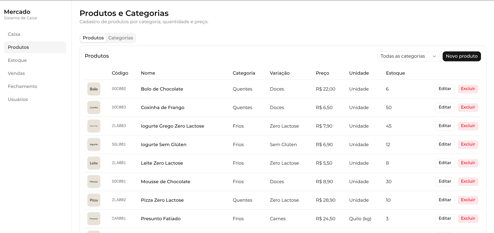

# Mercado — Sistema de Caixa de Supermercado

Sistema para controlar o caixa de um supermercado: cadastro de produtos, registro de
vendas com leitura de código, controle de estoque com aviso automático e painéis de
acompanhamento (produtos, vendas, estoque, fechamento de caixa).

## Site

[https://market-manager-1.onrender.com](https://market-manager-1.onrender.com)

## Funcionamento




## Tecnologias usadas

- **Next.js** — frontend (telas e interface)
- **NestJS** — backend (regras e API)
- **PostgreSQL** — banco de dados
- **Tailwind CSS** — estilo da interface

## Como rodar localmente

Pré-requisitos: Node.js e Docker instalados.

1. Subir o banco de dados (na raiz do projeto):
   ```bash
   docker compose up -d
   ```

2. Rodar o backend:
   ```bash
   cd api
   cp .env.example .env
   npm install
   npx prisma migrate dev
   npx prisma db seed
   npm run start:dev
   ```
   Fica disponível em `http://localhost:3001`.

3. Rodar o frontend (em outro terminal):
   ```bash
   cd web
   cp .env.local.example .env.local
   npm install
   npm run dev
   ```
   Fica disponível em `http://localhost:3000`.

4. Acessar `http://localhost:3000/login` no navegador.
